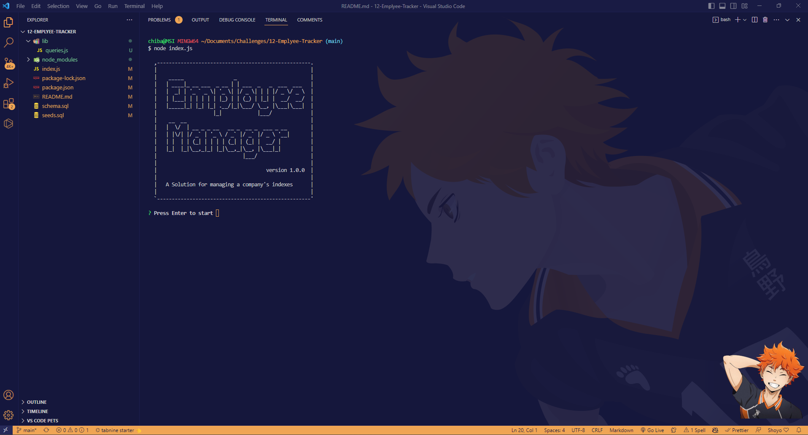
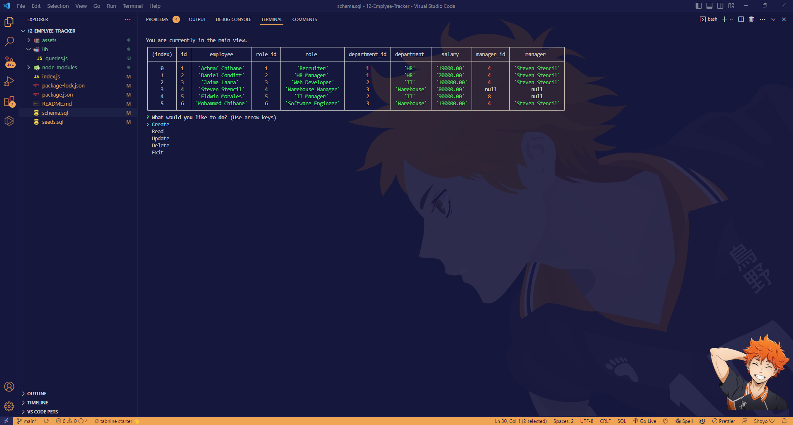
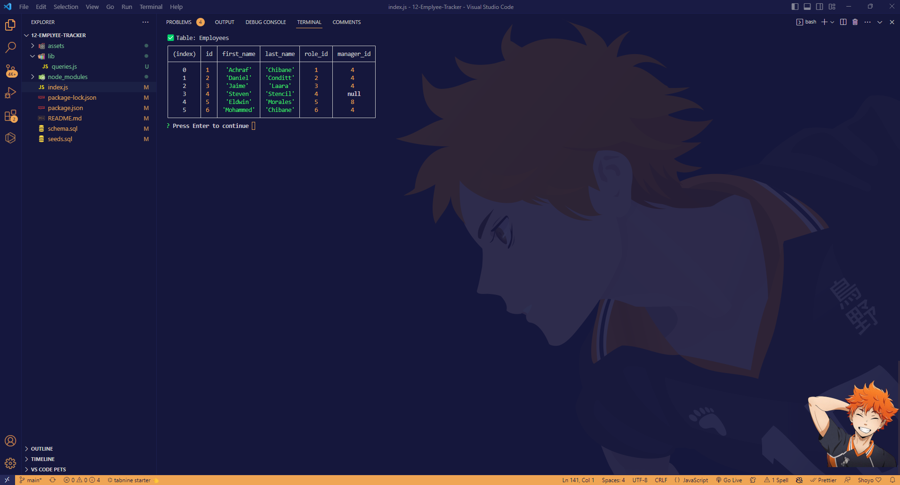
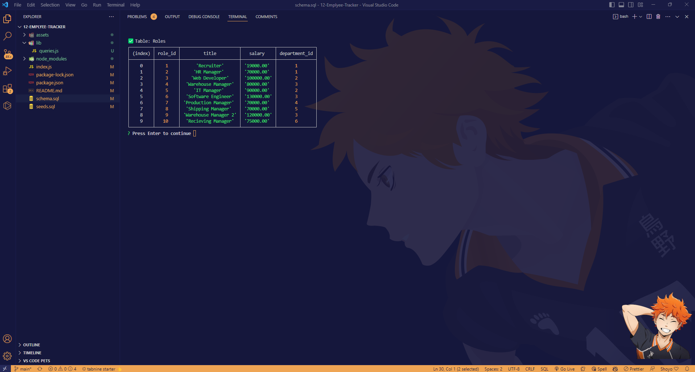
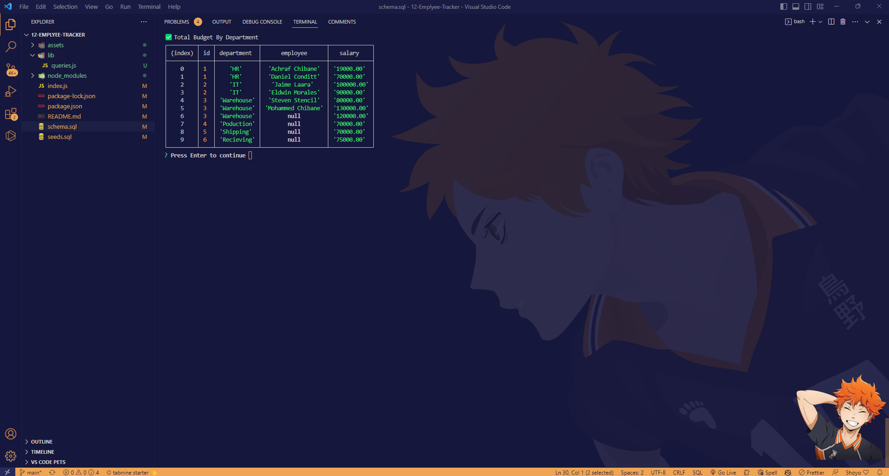

# 10-Team-Profile-Generator

[](https://badge.fury.io/gh/yourusername%2Fyourrepo)
[](https://travis-ci.org/yourusername/yourrepo)
[](https://coveralls.io/github/Ash0422/09_README_Generator?branch=master)

## Description
```
Developers frequently have to create interfaces that allow non-developers to easily view and interact with information stored in databases.
These interfaces are called content management systems (CMS).  build a command-line application from scratch to manage a company's employee 
database, using Node.js, Inquirer, and MySQL.
```
## Screenshots






## Installation
To install the project follow these steps:
```
1- Clone the application from GitHub with:
   git clone [clone link from GitHub]
2- From the root folder, install the dependencies with:
   npm install
3- Run the app with:
   node index.js
```

## Usage

An application that can be used for managing a company's indexes
You can also watch a video demonstration of the application [here](https://watch.screencastify.com/v/GcJ2Ye3b4En6NrBqEpyP).


## User Story
```
AS A business owner
I WANT to be able to view and manage the departments, roles, and employees in my company
SO THAT I can organize and plan my business
```
## Acceptance Criteria
```
GIVEN a command-line application that accepts user input
WHEN I start the application
THEN I am presented with the following options: view all departments, view all roles, view all employees, add a department, add a role, add an employee, and update an employee role
WHEN I choose to view all departments
THEN I am presented with a formatted table showing department names and department ids
WHEN I choose to view all roles
THEN I am presented with the job title, role id, the department that role belongs to, and the salary for that role
WHEN I choose to view all employees
THEN I am presented with a formatted table showing employee data, including employee ids, first names, last names, job titles, departments, salaries, and managers that the employees report to
WHEN I choose to add a department
THEN I am prompted to enter the name of the department and that department is added to the database
WHEN I choose to add a role
THEN I am prompted to enter the name, salary, and department for the role and that role is added to the database
WHEN I choose to add an employee
THEN I am prompted to enter the employee’s first name, last name, role, and manager, and that employee is added to the database
WHEN I choose to update an employee role
THEN I am prompted to select an employee to update and their new role and this information is updated in the database
```
## Contributing
Pull requests are welcome, please open an issue first to discuss what you would like to change. thank you

## Tests
This application has been tested by the creator and it works fine.<br>
this application has been uploaded to github: https://github.com/Ash0422/12-Emplyee-Tracker <br>

## Credits
- https://www.npmjs.com/package/@zhennann/mysql2
- https://www.npmjs.com/package/sql
- https://www.npmjs.com/package/schema.js 
- https://www.google.com/

## Questions
For any additional questions, please contact me at chibane.tkd04@gmail.com or visit my GitHub profile at https://github.com/Ash0422.

